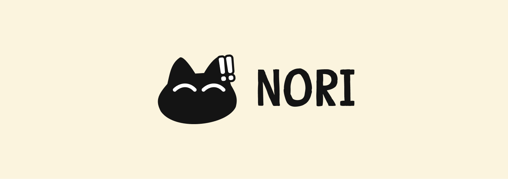
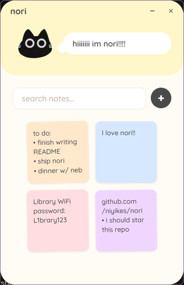
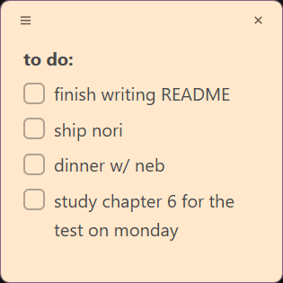

a really cute sticky notes app for your desktop (with cats!!!)

## what it does

- press `alt+n` anywhere for a notes window next to your cursor, and `alt+w` to close it
- add checkboxes for to-dos and check them off when youre done
- formatting like bold, italic, underline
- find your notes (and nori the cat) in a grid on the main window
- search through your notes
- closes to the tray instead of quitting
- nori the cat makes a snark (or cute) remark based on the time of the day

| | |
|---|---|
|  |  |

## stack

- tauri - the desktop shell
- react + typescript - the UI
- rust - the backend
- figma to design da cats

## why
i always get some random ideas or need to note some stuff fast.

i was bored of windows sticky notes and i wanted something that could pop up and close instantly

## make me a nori!

i need YOUR help making more nori cats! if you want your own nori on here:
1. draw a nori .svg or .png and put it in `src/assets/cat/`
2. open App.tsx and import it
3. add it to CAT_FACES 
5. add a message for it in DAY_MESSAGES or NIGHT_MESSAGES
6. open a pull request, or just send me the file

## ai usage
ai was used to debug. since i am new to rust, i used ai to help me learn and explain why things were breaking and how to fix them (especially the tauri/webview2 window issues)

ai was also used for some of the animations/styling